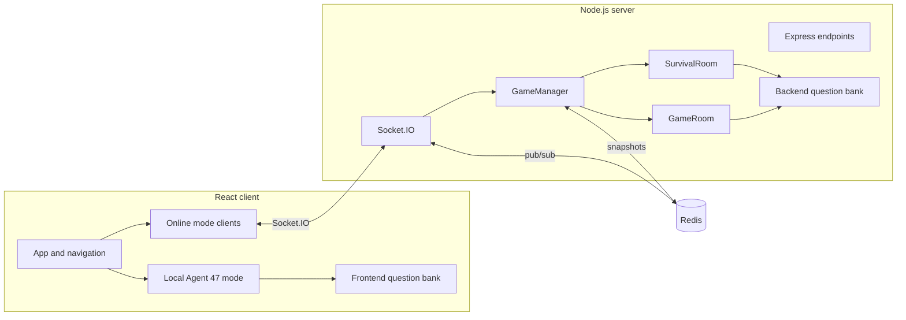

# HINTMAN

HINTMAN is a spy-themed deduction game. Identify each target from progressive clues before the AI or another player does.

The game includes a ten-target practice mission against Agent 47, two online duel formats, and a Survival room for up to six players.

## Contents

- [Game modes](#game-modes)
- [Run it locally](#run-it-locally)
- [How the game works](#how-the-game-works)
- [Architecture](#architecture)
- [Real-time API](#real-time-api)
- [HTTP endpoints](#http-endpoints)
- [Question content](#question-content)
- [Testing](#testing)
- [Deployment notes](#deployment-notes)
- [Troubleshooting](#troubleshooting)
- [Known constraints](#known-constraints)

## Game modes

| Mode | Players | Targets | Rules engine |
| --- | ---: | ---: | --- |
| **1 vs 1 Duel vs Agent 47** | 1 | 10 | Browser |
| **Quick Mission** | 2 | 5 | Socket.IO server |
| **Under Cover Mission** | 2 | 10 | Socket.IO server |
| **Codename: Survival** | 2-6 | Up to 20 | Socket.IO server |

### 1 vs 1 Duel vs Agent 47

The local practice mode needs no backend. You and the AI start with 5,000 HP. A correct answer damages the opponent; a wrong answer does not. The AI gets one chance to answer after each clue, with a higher success rate as more clues become visible.

Clues appear at roughly 1, 15, 30, 45, and 60 seconds. A target escapes after 120 seconds, with no damage to either side.

### Quick Mission

Quick Mission pairs two players for five questions drawn from the full online question bank. Both players start with 5,000 HP, and the first correct answer ends the target. Wrong answers do not cost health; the timeout result itself applies no damage.

### Under Cover Mission

Each player chooses a specialty before joining the queue. A ten-question deck is built from the server-side mappings for both selected IDs, with five questions drawn for each ID. Current matchmaking pairs players who selected different category IDs.

Available specialties are History, Science, Literature, Geography, Entertainment, Sports, and Food.

The current IDs are narrower than some labels in the interface: `science` excludes Technology and Medicine, `literature` excludes Art, and `food` excludes Culture.

### Codename: Survival

Two to six players share a 20-question deck and start with 10,000 HP. Everyone must mark themselves ready before the game begins.

Survival changes the risk model:

- Every revealed clue costs each living player health.
- A wrong answer damages only the player who submitted it.
- A timeout damages every living player.
- The first correct answer ends the target but does not directly damage anyone.
- The game ends when one or no players remain, or when the deck is exhausted.

If a player disconnects during a Survival match, the room pauses for a 60-second reconnection window. The player is eliminated if that window expires.

## Run it locally

### Prerequisites

- Git
- Node.js 20.19.x or 22.12.0 and newer. Node.js 22 LTS is recommended for Vite 7.
- npm
- A reachable Redis instance for online modes
- Docker, optional; needed only for the container command below

The repository contains separate frontend and backend packages. Running `npm install` at the repository root does not install either application.

### 1. Install

```bash
git clone https://github.com/loadsmile/hintman.git
cd hintman
npm --prefix backend install
npm --prefix frontend install
```

### 2. Configure the backend

Create `backend/.env`:

```dotenv
PORT=10000
REDIS_URL=redis://127.0.0.1:6379
```

Redis supplies Socket.IO pub/sub and short-lived room snapshots. If Docker is available, start a local instance with:

```bash
docker run --rm --name hintman-redis -p 6379:6379 redis:7-alpine
```

Start Redis before the backend. The code contains an in-memory fallback, but the shared Redis client can continue retrying before the HTTP server begins listening, so the fallback is not a dependable local startup path. Set `REDIS_URL` explicitly so development never depends on the hosted default in `backend/server.js`.

### 3. Configure the frontend

Create `frontend/.env.local`:

```dotenv
VITE_BACKEND_URL=http://localhost:10000
```

`VITE_BACKEND_URL` is read when Vite starts. Restart the frontend after changing it.

### 4. Start both applications

Run the backend:

```bash
npm --prefix backend run dev
```

Run the frontend in another terminal:

```bash
npm --prefix frontend run dev
```

Open [http://localhost:5173](http://localhost:5173). Check the backend at [http://localhost:10000/health](http://localhost:10000/health).

To work only on the Agent 47 mode, start the frontend by itself; Redis is not needed. Online modes require Redis, the backend, and at least two browser sessions.

### Commands

| Command | Purpose |
| --- | --- |
| `npm --prefix frontend run dev` | Start Vite with hot reload |
| `npm --prefix frontend run build` | Build the frontend into `frontend/dist` |
| `npm --prefix frontend run preview` | Serve the production frontend build locally |
| `npm --prefix frontend run lint` | Run ESLint across frontend source |
| `npm --prefix backend run dev` | Start the API with Nodemon |
| `npm --prefix backend start` | Start the API with Node.js |
| `npm --prefix backend test` | Run backend tests with `node:test` |

## How the game works

### A target lifecycle

1. The room chooses a target and sends its category, difficulty, and current health state.
2. The first clue appears after one second.
3. Duel clues then appear around 15, 30, 45, and 60 seconds; Survival clues appear around 13, 25, 37, and 49 seconds.
4. Players may answer before the first clue or submit more than one guess while a target is active.
5. The first accepted answer closes the target and reveals the answer.
6. If nobody answers within 120 seconds, the server broadcasts a timeout result.
7. The next target starts after a three-second transition.

Online timers, health updates, answer checks, and results are controlled by the backend. The countdown shown in the browser is a presentation of server-owned state, not the source of the result.

### Duel damage

Fewer clues produce more damage. A correct answer submitted before the first clue uses the one-clue value.

| Clues visible | Damage |
| ---: | ---: |
| 0-1 | 500 HP |
| 2 | 400 HP |
| 3 | 300 HP |
| 4 | 200 HP |
| 5 | 100 HP |

### Agent 47 behavior

The AI waits between two and eight seconds after a clue, then rolls against the probability for that clue count.

| Clues visible | Correct-answer chance |
| ---: | ---: |
| 1 | 15% |
| 2 | 25% |
| 3 | 50% |
| 4 | 65% |
| 5 | 80% |

### Survival penalties

Penalties rise as the field gets smaller.

| Players alive | Per-clue penalty | Wrong-answer penalty | Timeout penalty |
| ---: | ---: | ---: | ---: |
| 6 | 30 HP | 400 HP | 200 HP |
| 5 | 50 HP | 500 HP | 250 HP |
| 4 | 70 HP | 600 HP | 300 HP |
| 3 | 90 HP | 700 HP | 350 HP |
| 2 | 110 HP | 800 HP | 400 HP |

## Architecture



The frontend is a React 19 application built with Vite 7 and Tailwind CSS 3. `App.jsx` owns codename entry and mode selection; each mode keeps its own UI state. There is no router or external state store.

The backend combines Express and Socket.IO on one HTTP server. `GameManager` handles connections, matchmaking, room membership, reconnection, and persistence calls. `GameRoom` owns online duel rules. `SurvivalRoom` owns readiness, penalties, elimination, pause/resume, and ranking.

Redis provides the Socket.IO adapter and snapshot store. The current startup path expects a successful Redis connection. Active room objects and socket references remain process-local, so the deployment model is one backend instance.

### Repository map

```text
.
├── backend/
│   ├── server.js                         # Express, Socket.IO, Redis startup
│   ├── src/data/questions.json           # Online question bank
│   ├── src/models/GameRoom.js            # Two-player server rules
│   ├── src/models/SurvivalRoom.js        # Survival state machine
│   ├── src/models/Question.js            # Online answer matching
│   ├── src/services/GameManager.js       # Matchmaking and reconnection
│   ├── src/services/RedisService.js      # Room and player snapshots
│   └── test/survival-room.test.js
├── frontend/
│   ├── src/App.jsx                       # Entry flow and mode selection
│   ├── src/classes/                      # Local Question and Player models
│   ├── src/components/game/              # Shared game controls
│   ├── src/components/modes/             # Local, multiplayer, and Survival UIs
│   ├── src/data/questions.json            # Local question bank
│   └── src/services/CategoryService.js
├── ROADMAP.md                             # Audited risks and delivery plan
└── README.md
```

## Real-time API

Online play uses Socket.IO rather than a raw WebSocket connection. The client permits polling and WebSocket transports and reads the server URL from `VITE_BACKEND_URL`.

```js
import { io } from 'socket.io-client';

const socket = io('http://localhost:10000', {
  transports: ['polling', 'websocket'],
});
```

### Client events

| Event | Payload | Purpose |
| --- | --- | --- |
| `findMatch` | `{ playerName, gameMode, personalCategory, personalCategoryName }` | Join a general or category duel queue |
| `findSurvivalMatch` | `{ playerName, gameMode: 'survival', personalCategory, personalCategoryName }` | Join a Survival room |
| `playerReady` | none | Mark the current Survival player ready |
| `playerUnready` | none | Clear the current Survival player's ready state |
| `submitGuess` | `{ guess }` | Submit an answer for the active target |
| `checkReconnect` | `{ playerName }` | Ask whether a recent disconnected session exists |
| `reconnectToGame` | `{ roomId, playerName }` | Rebind a new socket to a disconnected player |

Example category match request:

```js
socket.emit('findMatch', {
  playerName: 'Nova',
  gameMode: 'category',
  personalCategory: 'science',
  personalCategoryName: 'Science & Technology',
});
```

### Server events

| Phase | Events |
| --- | --- |
| Connection | `serverError`, `canReconnect`, `reconnectSuccess`, `reconnectFailed` |
| Matchmaking | `waitingForMatch`, `matchFound`, `matchTimeout` |
| Ready state | `playerReady`, `playerUnready`, `allPlayersReady` |
| Target | `questionStart`, `hintRevealed`, `wrongAnswer`, `questionResult` |
| Player state | `playerEliminated`, `playerDisconnected`, `playerDisconnectedTemporary`, `playerReconnected`, `playerDisconnectedPermanent` |
| Room state | `gameStart`, `gamePaused`, `gameResumed`, `gameEnd`, `serverShutdown` |

The main target payloads are:

```js
// questionStart
{
  targetIndex: 1,
  totalTargets: 10,
  category: 'Physics',
  difficulty: 'medium',
  health: { '<socket-id>': 5000 }
}

// hintRevealed
{
  index: 0,
  text: 'This scientific principle changed how we understand motion',
  health: { '<socket-id>': 5000 }
}

// successful duel questionResult
{
  winner: '<socket-id>',
  winnerName: 'Nova',
  correctAnswer: "Newton's First Law",
  timeElapsed: 8.42,
  health: { '<socket-id>': 5000, '<opponent-id>': 4500 },
  hintCount: 1,
  healthLoss: 500
}
```

Survival adds `round` and `remainingQuestionTimeMs` to `questionStart`. Its `hintRevealed` payload adds `timePenalty` and `remainingQuestionTimeMs`. A timeout result adds `winnerName: null`, `timeoutPenalty`, and `isTimeout: true`; eliminations arrive separately through `playerEliminated`.

Event payloads are plain JavaScript objects and do not currently have a versioned schema. When changing a payload, update both the producer in `backend/src` and every listener under `frontend/src/components/modes` in the same change.

## HTTP endpoints

Gameplay is event-driven. Express provides health and diagnostic routes:

| Method | Path | Response |
| --- | --- | --- |
| `GET` | `/` | Service name, version, Redis state, and initialization state |
| `GET` | `/health` | Uptime, Redis state, connected player count, and room count |
| `GET` | `/admin/stats` | Process memory and game-manager statistics |
| `GET` | `/admin/redis-test` | Redis write/read check plus room and player key counts |
| `GET` | `/admin/redis-connections` | Redis connection usage and a sample of client details |

Example:

```bash
curl http://localhost:10000/health
```

The `/admin/*` routes are unauthenticated diagnostics in the current code. Protect or remove them before exposing the backend publicly; they can reveal process and infrastructure details.

## Question content

HINTMAN currently keeps two JSON catalogs:

| File | Used by | Entries |
| --- | --- | ---: |
| `frontend/src/data/questions.json` | Local Agent 47 mode | 1,564 |
| `backend/src/data/questions.json` | Online modes | 1,323 |

The files are edited independently. Add a target to the catalog used by its mode, and add it to both only when both modes need it.

### Content model

```json
{
  "id": "q1",
  "answer": "Newton's First Law",
  "category": "Physics",
  "difficulty": "medium",
  "hints": [
    "This scientific principle changed how we understand motion",
    "Named after an English physicist and mathematician",
    "Also known as the Law of Inertia",
    "States that objects at rest stay at rest unless acted upon by force",
    "F = ma is related, but this is specifically about objects in motion or at rest"
  ]
}
```

### Authoring checklist

- Give every target a unique string `id`. Existing numeric suffixes contain gaps, so inspect the files before choosing one.
- Use one of the current categories: `Art`, `Biology`, `Culture`, `Entertainment`, `Food`, `Geography`, `History`, `Literature`, `Medicine`, `Music`, `Physics`, `Science`, `Sports`, or `Technology`.
- Set `difficulty` to `easy`, `medium`, or `hard`.
- Provide exactly five non-empty clues.
- Order clues from broad to specific. The final clue should make the answer reachable without stating it verbatim.
- Keep facts self-contained. A player sees the category and clues, not a source citation or extra context.
- Check for duplicate IDs and answers in both catalogs.
- Test plausible abbreviations, punctuation, and near misses in the mode that will use the target.

Local and online answer matching are deliberately tolerant but use different algorithms. The local matcher removes articles and common words and allows close word matches. The server accepts normalized exact matches, substantial containment, or at least 70% matching answer words. A content change can therefore behave differently in local and online play.

Parse both catalogs from the repository root with:

```bash
node -e "for (const file of ['./frontend/src/data/questions.json', './backend/src/data/questions.json']) { const data = require(file); console.log(file, data.length) }"
```

## Testing

Run the automated checks from the repository root:

```bash
npm --prefix backend test
npm --prefix frontend run lint
npm --prefix frontend run build
```

The backend suite currently contains two lifecycle tests. They verify that Survival pause/resume preserves timer delays and that reconnection does not register duplicate socket handlers. There are no frontend, HTTP integration, Redis integration, or browser end-to-end tests yet.

For a focused multiplayer smoke test:

1. Start the backend and frontend.
2. Open the app in two separate browser sessions and enter different codenames.
3. Join Quick Mission from both sessions and confirm one shared target starts.
4. Submit a wrong answer, then a correct answer, and confirm both clients receive the same result and health state.
5. Repeat with Under Cover using different specialties.
6. Start Survival, ready both players, disconnect one during a target, and reconnect within 60 seconds.

## Deployment notes

The frontend and backend deploy as separate services.

- Build the frontend with `npm --prefix frontend run build` and publish `frontend/dist`.
- Set `VITE_BACKEND_URL` in the frontend build environment to the public backend origin.
- Run the backend with `npm --prefix backend start`; it binds to `0.0.0.0` and reads `PORT`.
- Set `REDIS_URL` to an explicit TLS-protected production instance.
- Add the production frontend origin to `corsOptions` in `backend/server.js`. Allowed origins are hard-coded today.
- Keep one backend instance. Redis publishes Socket.IO messages and stores snapshots, but game ownership remains in memory.
- Do not claim process-restart recovery. Snapshots are written with expiry times but are not hydrated into playable rooms at startup.
- Restrict `/admin/*` before the service is reachable from the public internet.

## Troubleshooting

### The app opens, but online modes cannot connect

Open `http://localhost:10000/health`. If it does not respond, start the backend. If it does respond, confirm `frontend/.env.local` contains the same origin in `VITE_BACKEND_URL`, then restart Vite.

### The backend repeats Redis connection errors and never starts

Confirm that Redis is running at the URL in `backend/.env`, then restart the backend. The current startup sequence waits for the shared Redis connection before opening the HTTP port, despite the intended in-memory fallback.

### Matchmaking never completes

Quick Mission and Under Cover require two clients. Under Cover currently matches players only when their category IDs differ. Survival needs at least two players, and every player in the room must ready up.

### The page has a plain dark background

`frontend/src/index.css` references `/background.png` and `/backgroundcity.png`, both stored at the Vite project root. Confirm the deployment uses `frontend` as its root directory and includes those files in the build context. The CSS uses a dark color when an image cannot load.

### A new question works locally but not online

Confirm that it was added to the correct catalog. The two modes use different files and different answer-matching implementations.

## Known constraints

This repository is a playable prototype with production work still open. The most important current boundaries are:

- Reconnection is identified by player name and room ID rather than an opaque session token.
- Socket payloads are not schema-validated or rate-limited.
- A duel timeout does not mark the target answered before the three-second transition, so a late correct guess can still change health and schedule another transition.
- Shared Survival penalties can eliminate every remaining player at once; the current results still select the first ranked row as the winner.
- The browser question catalog overlaps the server catalog, so online answers are present in the frontend bundle.
- Redis snapshots do not restore active matches after a process restart.
- Room ownership is process-local; horizontal scaling is not supported.
- Diagnostic endpoints are public unless deployment infrastructure restricts them.
- Question catalogs and answer-matching rules are duplicated between frontend and backend.
- Automated coverage is limited to two Survival lifecycle tests.

See [ROADMAP.md](./ROADMAP.md) for the audited delivery plan, security work, data-integrity tasks, and test priorities.

## Contributing

Keep changes small enough to verify across both sides of the connection.

1. Describe user-visible rule changes in the pull request.
2. Update the client and server together when changing a Socket.IO event.
3. Update both question catalogs only when the target belongs in both runtimes.
4. Run the backend tests, frontend lint, and frontend production build.
5. Update this README when setup, behavior, configuration, or contracts change.

Do not commit `.env` files, credentials, generated dependency bundles, or local build output.
